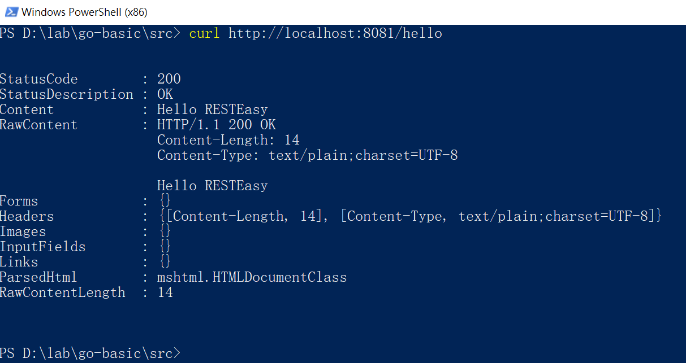

# Memo

建立Quarkus的Gradle專案

    mvn io.quarkus:quarkus-maven-plugin:2.3.0.Final:create -DprojectGroupId=org.acme -DprojectArtifactId=getting-started -DclassName="org.acme.quickstart.GreetingResource" -Dpath="/hello" -DbuildTool=gradle

跟Quarkus Cookbook不同的是新版plugin預設會以artifactId建立目錄

    gradlew quarkusDev -Dquarkus.http.port=8081

